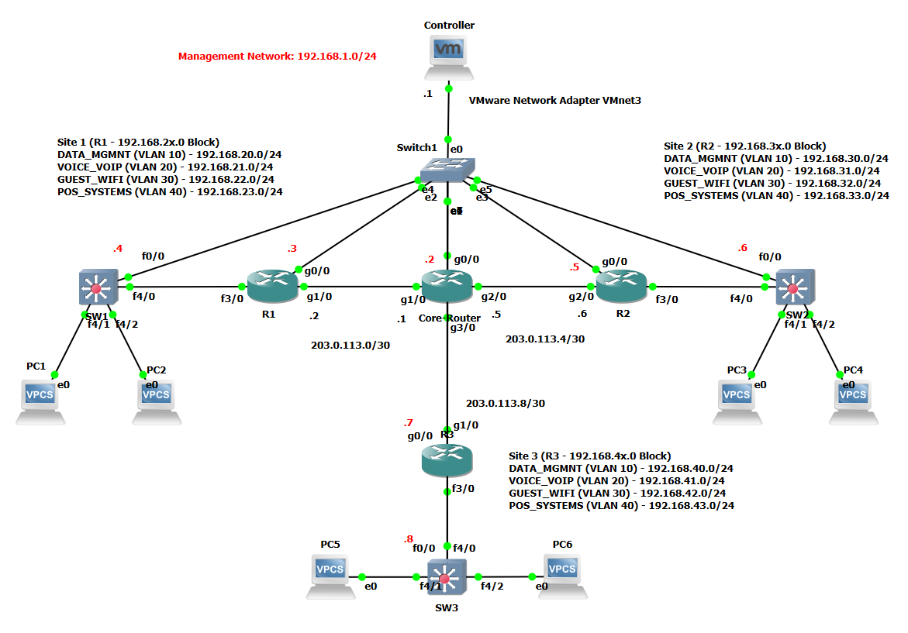

# Network Automation with Nornir

Group Assignment for WIC2005 PROGRAMMABLE NETWORK. This project automates the deployment of a Hub-and-Spoke network topology using **Python** and **Nornir**. It configures Layer 2 switching (VLANs, Trunks) and Layer 3 routing (OSPF, NAT, Site-to-Site VPN) on Cisco IOS devices.

## 🚀 Features
* **Automated Configuration**: Pushes config to Switches and Routers simultaneously.
* **Jinja2 Templating**: Uses dynamic templates for modular configuration.
* **Connectivity Check**: Includes a script to verify device reachability before deployment.
* **Visual Feedback**: Uses a loading spinner (`halo`) and progress bars for a professional CLI experience.
* **Logging**: Automatically saves deployment logs with timestamps to a `logs/` directory.

## 🛠️ Project Structure
```text
├── inventory/          # Hosts, Groups, and Defaults definitions
├── templates/          # Jinja2 templates (router_l3.j2, vlan_switch.j2)
├── logs/               # Deployment logs (ignored by git)
├── config.yaml         # Nornir configuration file
├── deploy_network.py   # Main automation script
├── check_connectivity.py # Pre-flight check script
└── requirements.txt    # Python dependencies
```

## 📋 Prerequisites
- Python 3.8+
- GNS3 or EVE-NG with Cisco IOS images (e.g., c7200, iou).
- A topology matching the inventory/hosts.yaml definitions.

## 📡 Topology



## 🔌 Day 0 Configuration (Bootstrap)
Before running the automation scripts, every device must have a basic "Day 0" configuration manually applied via the console. This ensures the GNS3/EVE-NG controller can reach the devices via SSH.

Copy and paste the configuration in [zero-day-config.txt](zero-day-config.txt).

### Credentials used in this lab:
- **Username:** admin
- **Password:** cisco
- **Enable Secret:** cisco

## 📦 Installation
Clone the repository:

```Bash
git clone https://github.com/Jindddd/nornir-cisco-automation.git
cd nornir-cisco-automation
```

Create a virtual environment (optional but recommended):
```Bash
python3 -m venv venv
source venv/bin/activate  # On Windows: venv\Scripts\activate
```

Install dependencies:
```Bash
pip install -r requirements.txt
```

## ▶️ Usage
### 1. Check Connectivity
Verify that all devices in your topology are reachable.
```Bash
python3 check_connectivity.py
```

### 2. Deploy Configuration
Run the main script to push configurations to all devices.
```
Bash
python3 deploy_network.py
```

## 📝 Configuration Details
**Switches:** Configured with VLANs 10, 20, 30, 40 and Trunks.

**Routers:**
- OSPF Area 0 on WAN, Area 1 on Spoke LANs.
- NAT/PAT configured on Spokes for Direct Internet Access (DIA).
- IPSec VPN established directly between Site 1 and Site 2.

### Network Configuration Overview
This project automates a Hybrid Hub-and-Spoke network topology designed for enterprise connectivity. It integrates local switching, dynamic routing, direct internet access, and secure site-to-site tunneling.

#### 1. Layer 2 Switching (Campus LAN)
- **VLAN Segmentation:** Each branch site is segmented into four distinct VLANs: Data (10), Voice (20), Guest (30), and POS (40).
- **Trunking:** Uplinks from Access Switches to Branch Routers use 802.1Q Encapsulation to carry tagged traffic.
- **Access Layer:** Ports are statically assigned to VLANs, with PortFast enabled to bypass Spanning Tree listening states for end devices.

#### 2. Layer 3 Routing (OSPF)
Area Design:
- **Area 0 (Backbone):** Connects the WAN links between the Core Router and Branch Routers (R1, R2).
- **Area 1 (Stub/Branch):** Contains the local LAN subnets at each branch site.
- **WAN Adjacency:** WAN links are configured as OSPF Point-to-Point networks to eliminate DR/BDR elections and speed up convergence.
- **Inter-VLAN Routing:** Branch Routers perform Router-on-a-Stick (ROAS) using 802.1Q sub-interfaces to route traffic between local VLANs.

#### 3. Internet Edge (NAT/PAT)
- **Direct Internet Access (DIA):** Branches do not backhaul internet traffic to HQ. Instead, they route directly to the ISP (simulated by the Core).
- **NAT Overload (PAT):** Internal private IPs (RFC1918) are translated to the router's single public WAN IP using Port Address Translation, allowing multiple users to share one public identity.
- **Virtual Reassembly:** IP Virtual Fragmentation Reassembly (VFR) is enabled to handle fragmented packets during translation.

#### 4. WAN Security (IPSec VPN)
- **Architecture:** Direct Spoke-to-Spoke VPN. While the physical path goes through the Core, the logical tunnel is established directly between Site 1 and Site 2.
- **Encryption:** Uses AES-256 for encryption and SHA-HMAC for integrity (IKEv1 / ISAKMP Group 14).
- **Traffic Filtering:** Specific Access Control Lists (ACLs) ensure that VPN traffic is excluded from NAT and encapsulated into the tunnel immediately.

## 🔍 Verification

| Device Name | Connect to Switch Port | Assigned VLAN | Purpose |
|-------------|------------------------|---------------|---------|
| PC1 (Site 1) | `SW1 Fa4/1` | `VLAN 10 (Data)` | Test Data VLAN |
| PC2 (Site 1) | `SW1 Fa4/2` | `VLAN 20 (Voice)` | Test Inter-VLAN Routing |
| PC3 (Site 2) | `SW2 Fa4/1` | `VLAN 10 (Data)` | Test Site-to-Site VPN |
| PC4 (Site 2) | `SW2 Fa4/2` | `VLAN 20 (Voice)` | Test VPN + Inter-VLAN |

### Test 1: Verify Inter-VLAN Routing (ROAS)
- Goal: Prove that different departments (VLANs) at the SAME site can talk to each other.
- Action: From PC1, ping PC2.

```Bash
ping 192.168.21.10
```

*Why it works: Traffic goes from PC1 -> SW1 -> R1 (via Trunk) -> R1 routes between Sub-interfaces -> SW1 -> PC2.*


### Test 2: Verify Internet Access (NAT)
- Goal: Prove that private branches can reach the "Public" internet.
- Action: From PC1, ping the Core-Router's WAN IP (simulating the internet).

```Bash
ping 203.0.113.1
```

*Why it works: R1 translates PC1's private IP (192.168.20.10) to its public WAN IP (203.0.113.2) using NAT. If this fails, the Core Router won't know how to reply to the private IP.*

> Check NAT: On R1, run `show ip nat translations`. You should see an entry for ICMP when you ping the Core.

### Test 3: Verify Site-to-Site VPN
- Goal: Prove that Site 1 can securely talk to Site 2 over the "public" network.
- Action: From PC1 (Site 1), ping PC3 (Site 2).

```Bash
ping 192.168.30.10
```
*Why it works: R1 sees traffic destined for 192.168.30.x. The Crypto Map ACL matches this traffic. R1 encrypts the packet and tunnels it to R2. R2 decrypts it and delivers it to PC3. Note: The first ping might timeout while the VPN tunnel negotiates.*

> Check VPN: On R1, run `show crypto isakmp sa` and `show crypto ipsec sa`